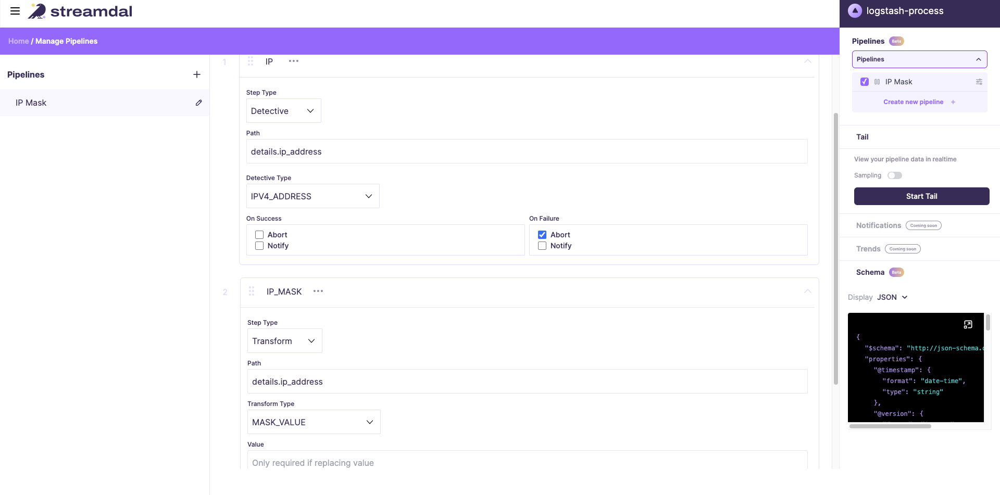
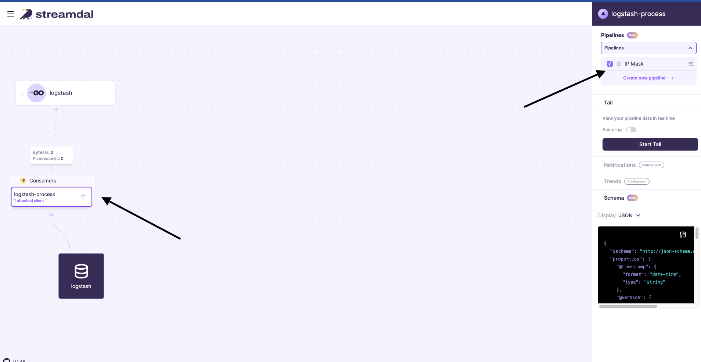
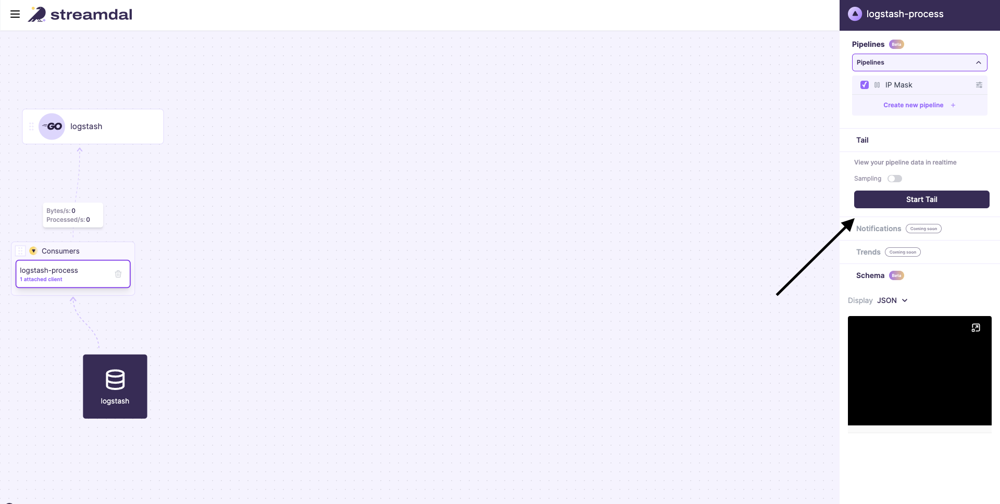
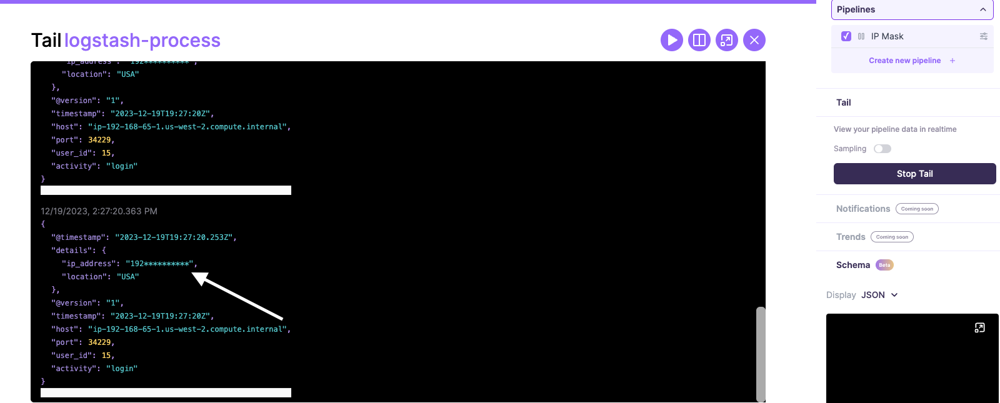
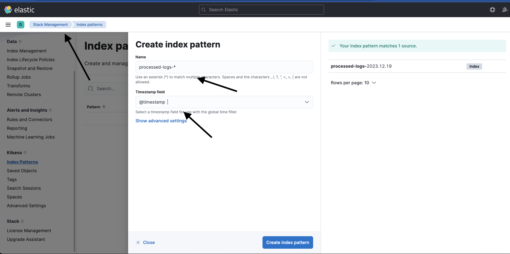
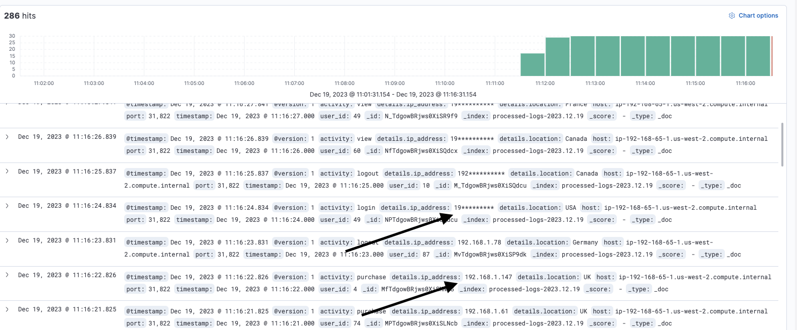

<div align="center">
   
  

[](https://github.com/streamdal/streamdal)
[](https://discord.gg/streamdal)

</div>  

## Real-Time Log Processing with Streamdal and Go

### Overview

Leverage the power of Streamdal to supercharger your existing logging solution.

### Features

**Real-Time Log Processing:** Fast processing of incoming logs with minimal latency.

**PII Redaction:** Automated redaction of sensitive information from logs.

**Centralized Rule Management:** Streamdal provides a UI for central rule management. These rules are then pulled in from the log-processing agents across your organization.

**Scalable Architecture:** Designed to handle high volumes of log data efficiently.Blazing fast pipelines, all function built using WASM, and pushed down to local log-processors to distribute load to the edge and allow for realtime processing.  

**Go Processing Agent:** Custom-built agent for processing logs.

### Getting Started

The steps below will deploy the Streamdal stack along with a logstash environment to demonstrate how the solution works

1. Deploy Streamdals Server see https://github.com/streamdal/streamdal/tree/main/install/docker
1. Clone this repo ```git clone git@github.com:streamdal/log-processor.git``
1. Bring up development environment ```cd log-processor/;docker-compose up -d```
1. View Streamdal UI http://127.0.0.1:8080/
1. Execute log generator to send sample data ```python3 log-generator.py```
1. Create a pipeline

1. Attach Pipeline to the Data Stream

1. Use Streamdal's tail to confirm IPs are masked

1. You should see the masked IP

1. Goto kibana http://127.0.0.1:5601/
1. Create a kibana pattern

1. Confirm IP data is masked in Kibana



### Deploying in prod / existing logstash

1. Deploy Streamdal to kubernetes using the helm https://github.com/streamdal/streamdal/tree/main/install/helm
1. Deploy log-processor to all your logstash agents using docker or via the binary streamdal/log-processor
1. Update logstash agent to send the json logs you want to process to the log-processor 

```
input {
  tcp {
    port => 5044
    codec => json_lines
  }
}

output {
  stdout { codec => rubydebug}
  tcp {
    host => "go-app" 
    port => 6000
    codec => json_lines
  }
}
```
4. Add a section to recieve the processed data from the Streamdal log-processor and output to final destination

```
input {
  tcp {
    port => 7002
    codec => json_lines
  }
}

output {
  elasticsearch {
    hosts => ["elasticsearch:9200"] # Assumes Elasticsearch service is named 'elasticsearch' in docker-compose
    index => "processed-logs-%{+YYYY.MM.dd}" # Customize the index name as needed
  }
}
```
5. Access the Streamdal Console you deployed earlier to apply whatever pipelines / rules needed.


# Community

We're building Streamdal in the open and we'd love for you to join us!

Join our [Discord](https://discord.gg/streamdal)!